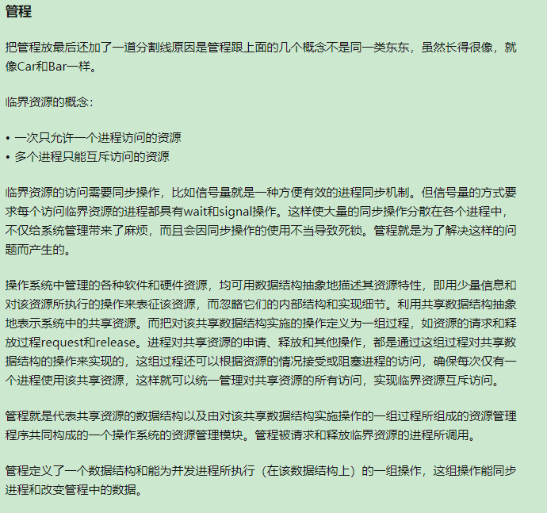

## 
  some miscellaneous  
 ##

---

**Forgettable**
 - `std::forward<Type>(arg)` : 返回Type&& 类型引用，右值引用用于表达式时为左值，此时需要forward转发保持类型  

 - `static` : 成员函数只能访问static成员变量与其它static成员函数(没有this指针)，但是可以访问构造函数

 -  类内包含不支持拷贝操作的成员时候，类的拷贝构造函数，拷贝赋值运算符默认标记为`delete`

 -  `noexcept`：默认不使用，大部分情况下，你都很难避免bad_alloc的异常，即使这个函数不直接allocate，有可能编译器执行代码时还是需要allocate。比如最简单的a = b，如果a和b是一个自定义的type，有可能这个type有类似vector、string这些需要allocate的member，那这个赋值语句就可能报错。而且即使这个type现在没有这样的member，以后说不定代码改来改去就加了一个这样的成员，不使用noexcept是最future-proof的。move constructor/assignment operator 如果不会抛出异常，一定用noexcept。如果destructor抛出异常，程序99%会挂掉，用noexcept基本没任何坏处。简单的leaf function，像是int，pointer这类的getter，setter用noexcept，因为不可能出错

- `class member function generate`:
  - copy constructor 和 copy assignment对于编译器来说是相互独立的，自定义(explicit)了其中一个，编译器还会自动生成另外一个 ***(deprecated in cpp11 and ater)***
  - move constructor 和 move assignment对于编译器来说是相关的，自定义(explicit)了一种一个，会阻止编译器生成另外一个，如果想用，手动定义
  - 自定义(explicit)了copy operation之后，编译器不会生成默认的move operation。条件结果相反也成立
  - 自定义(explicit)了deconstructor之后，编译器不会生成默认的move operation,可以生成默认的copy operation ***deprecated in cpp11 and later)***
  - 当有自定义的deconstructor、copy constructor、copy assignment其中之一的时候，剩下两个也应该显式定义 (named rule of three)  

- `smart pointers`
  - shared_ptr最好不要用raw pointer初始化，prefer std::make_shared，如果要指定deleter非要用raw pointer eg：  
  `std::shared_ptr<int> i_tmp(new int, deleter);`  
  `auto i_copy(i_tmp)`
  - shared_ptr只用于single object(`std::shared_ptr<T>`)，unique_ptr可以用于array(`std::unique_ptr<T[]>`)
  - 不同deleter的`shared_ptr<T>(raw_ptr)`(模板参数只有T)是同一类对象，可以互相赋值，可以放在同一个容器中(因为额外信息放在control block中)，不同deleter的`unique_ptr<T,decltype(deleter)>(raw_ptr, delter)`是不同的对象，不能做一样的事情

---

 

**并行：同一时刻真的有多个任务在运行**  
**并发：同一时刻只有一个任务在运行，快速切换感觉像在同时运行**

**why并发?**      
 - 分离关注点：相关代码与无关代码分离  
 - 性能

**如何避免死锁?**  
 - 避免嵌套锁 
 - 使用固定顺序获取多个锁
 - 定义遍历容器的顺序（比如链表删除操作）
 - 使用层次锁来避免 

**atomic memory order param**
 - Store操作： `memory_order_relaxed， memory_order_release， memory_order_seq_cst`
 - Load操作：`memory_order_relaxed， memory_order_consume， memory_order_acquire， memory_order_seq_cst`
 - Read-modify-write操作：`memory_order_relaxed， memory_order_consume， memory_order_acquire， memory_order_release， memory_order_acq_rel， memory_order_seq_cst`

**内存序列选项**
 - 顺序一致序列：`memory_order_seq_cst`
 - 获取-释放序列：`memory_order_consume， memory_order_acquire， memory_order_acq_rel， memory_order_acq_rel`
 - 自由序列：`memory_order_relaxed`

**std::atomic\<UDT\>**
 - 必须有拷贝赋值运算符（编译器创建的）
 - 不能有虚函数或者虚基类
 - 所有成员必须支持拷贝赋值运算符
 - 位可比较的(保证CAS操作)

  

**自旋锁**  
***一个线程在获取锁的时候，如果锁已经被其它线程获取，那么这个线程将循环等待，直到锁被获取才退出***  
 - 优点 : 不会使线程状态发生切换进入阻塞，一直处于用户态，减少了不必要的上下文切换  
 - 缺点 : 当一个线程持有锁时间过长，其它想要获取锁的线程过多时，会导致cpu占用率极高

---

 

**进程**   
&emsp;"并发",同一时刻只有一个在运行，但感觉起来像多个同时运行；并行是同一时刻真的有多个在运行的执行，操作系统需要一个结构来抽象和表示这个程序的运行
- 进程是操作系统对一个正在运行的程序的一种抽象结构
- 进程是指在操作系统中能独立运行并作为资源分配的基本单位，由一组机器指令、数据和堆栈等组成的能独立运行的活动实体
- 操作系统可以同事运行多个进程， 多个进程可以并发执行和交换信息
- 进程在运行时需要一定的资源，如cpu、存储空间和I/O设备等  

 

**线程**  
&emsp;进程是资源分配的基本单位，进程的调度设计到的内容比较多（存储空间、cpu、I/O资源、进程现场保护），调度开销比较大，在并发的切换过程效率比较低。为了更高效的进行调度，提出了比进程更轻量的独立运行和调度的基本单位。
- 线程比进程更轻量
- 线程能独立运行，独立调度，拥有资源（一般是CPU资源，程序计数器等）
- 线程调度能大幅度缩小调度的成本，线程的切换不会引起进程的切换
- 线程的引入进一步提高了操作系统的并发性，线程能并发执行
- 同一个进程的多个线程共享进程的资源（省去了资源调度现场保护的很多工作）

 

**协程**
- 协程是用户模式下的轻量级纤程，操作系统对协程一无所知
- 协程的调度完全由应用程序控制，操作系统不管这部分的调度
- 一个线程可以包含一个或多个协程
- 协程拥有自己的寄存器上下文和栈，协程调度切换时将寄存器上下文和栈保存起来
- 协程能保留上一次调用时的状态，看到各种生成器（阉割的协程）

 

**纤程(windows下的协程概念)**  
&emsp;代码的易移植性一直是平台间交互考虑的重点，在将应用程序从Unix移植到Windows的过程中，会存在一些类似于线程栈管理的不一致，结果和异常处理不一致等问题，增加了移植难度和成本。
- 线程是在内核中实现的，操作系统会根据系统的调度算法对线程进行调度
- 纤程是在用户模式下实现的，内核对纤程一无所知
- 纤程是更轻量级的线程，一个线程可以包含多个纤程
- 内核会对线程进行抢占式调度，线程一次只能执行一个纤程的代码（具体的执行由用户调度算法决定）
- 纤程的调度与线程的调度没有直接关系，操作系统随时可能会夺取纤程所在纤程的运行权
- 除非正在运行的纤程显式的切换到另一个纤程，否则其它纤程无法运行
- Windows有一套API来将纤程转换为纤程或者在同一个线程里面创建多个纤程

<!---->

---

 

**位操作算法**  
`1. x & (x-1)` 消去x的最后一位1  
`x = 0b1100`  
`x - 1 = 0b1011`  
`x & (x - 1) = 1000`  

`2.异或遵循交换律和结合律`  
 `a ^ a = 0`  
 `b ^ 0 = b`

