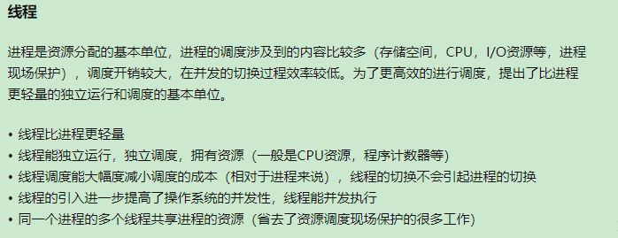
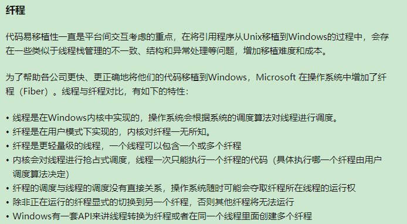
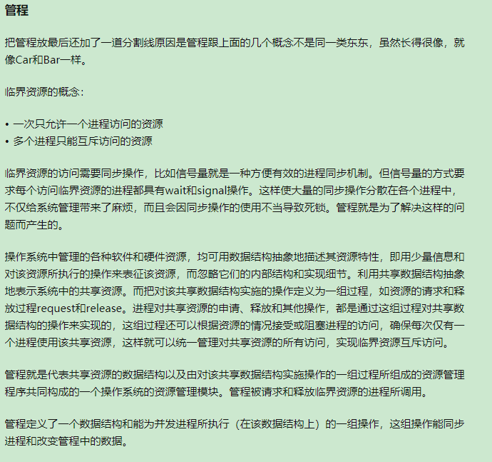
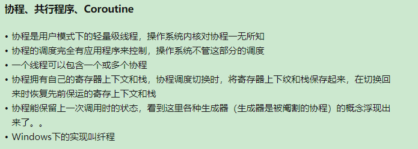

 ---

  `std::forward<Type>(arg)` : 返回Tpye&& 类型引用，右值引用用于表达式时为左值，此时需要forward转发保持类型  

  
 
 ---

 noexcept：默认不使用。大部分情况下，你都很难避免bad_alloc的异常，即使这个函数不直接allocate，有可能编译器执行代码时还是需要allocate。比如最简单的a=b，如果a和b是一个自定义的type，有可能这个type有类似vector，string这些需要allocate的member，那这个赋值语句就可能报错。而且即使这个type现在没有这样的member，以后说不定代码改来改去就加了一个这样的成员。如果你给a=b加上了noexcept，那以后加这样一个member，你还得把noexcept去掉。不使用noexcept是最future-proof的。move constructor/assignment operator 如果不会抛出异常，一定用noexcept。destructor一定用noexcept。因为如果destructor抛出异常，程序99%会挂掉，你用noexcept基本没任何坏处。简单的leaf function，像是int，pointer这类的getter，setter用noexcept。因为不可能出错

  

 ---

   并行：同一时刻真的有多个任务在运行    
   并发：同一时刻只有一个任务在运行，快速切换感觉像在同时运行  
 
 **why并发?**      
  - 分离关注点：相关代码与无关代码分离  
  - 性能

 **避免死锁**  
  - 避免嵌套锁 
  - 使用固定顺序获取多个锁
  - 定义遍历容器的顺序（比如链表删除操作）
  - 使用层次锁来避免 

  

 
 
 
 
 

---